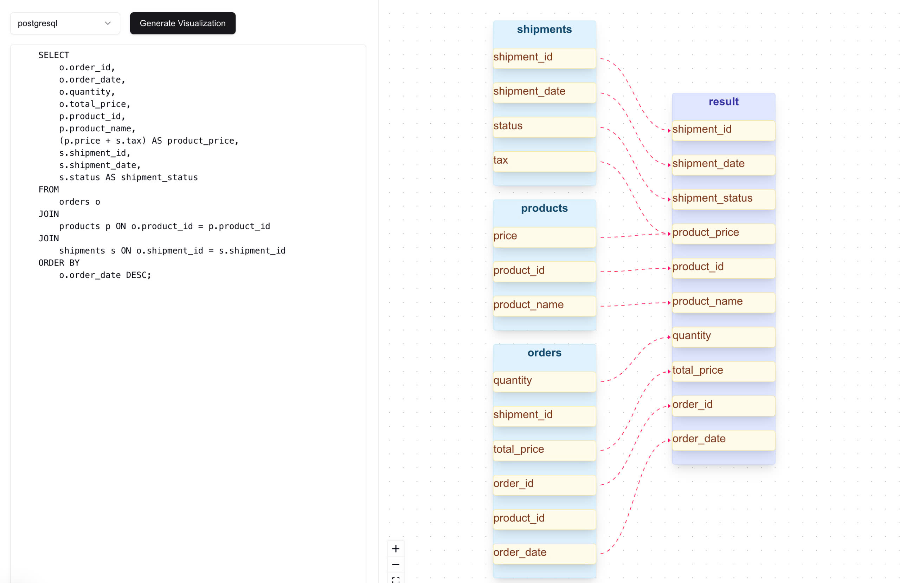

# SQL Visualization

An interactive web application that helps users understand SQL queries through visual representations.



This visualization shows the relationship between three main tables:

- **Shipments**: Contains shipping information including dates, status, and tax
- **Products**: Stores product details including name and price
- **Orders**: Manages order information with quantities and pricing

## Features

- Interactive SQL query visualization
- Real-time query parsing and diagram generation
- User-friendly interface for SQL exploration
- Support for common SQL operations and joins

## Getting Started

First, install the dependencies:

```bash
npm install
# or
yarn install
# or
pnpm install
```

Then, set up your environment variables:

```bash
# Create a .env.local file and add your OpenAI API key
OPENAI_API_KEY=your_api_key_here
```

Then, run the development server:

```bash
npm run dev
# or
yarn dev
# or
pnpm dev
```

Open [http://localhost:3000](http://localhost:3000) with your browser to see the application.

## Tech Stack

- [Next.js](https://nextjs.org) - React framework for production
- TypeScript for type safety
- Tailwind CSS for styling
- [ReactFlow](https://reactflow.dev/) - A highly customizable library for building node-based editors and interactive diagrams
